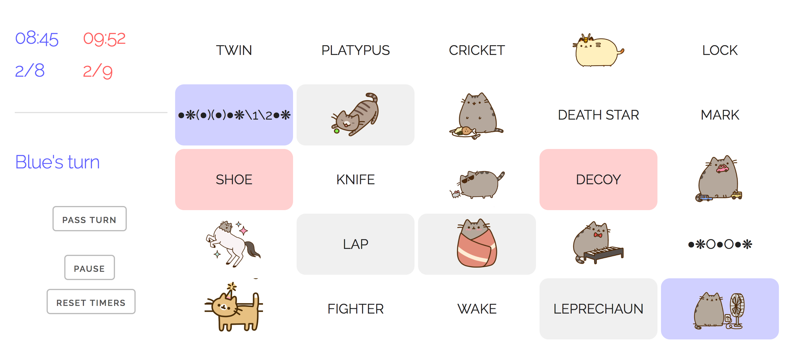

Codenames
=========

A web-based implementation of [Codenames](http://github.com). Personal use only, no copyright infringement intended.

Features
--------

- Many custom word lists: STEM, regular expressions, etc.
- [Pusheens](http://www.pusheen.com/)

To-do
-----

- Fully web-based mode
- Adjustable 